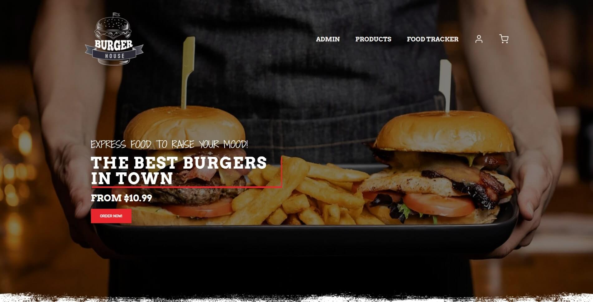
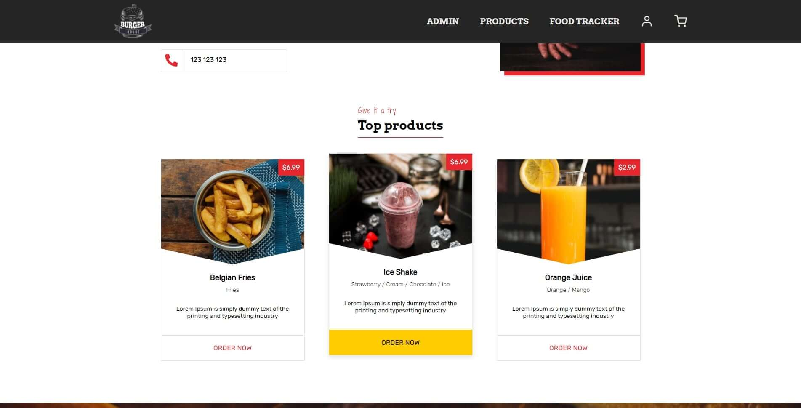
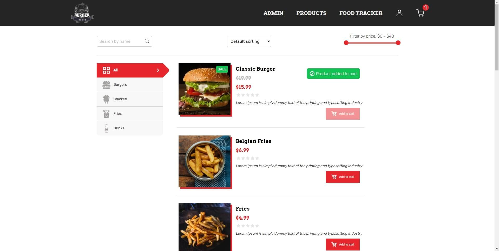
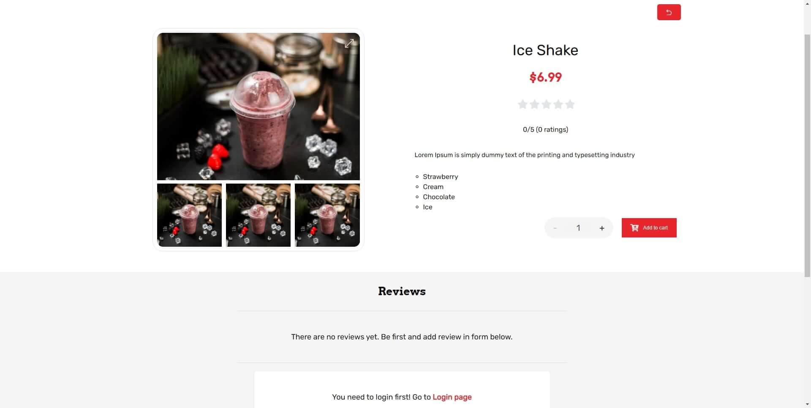
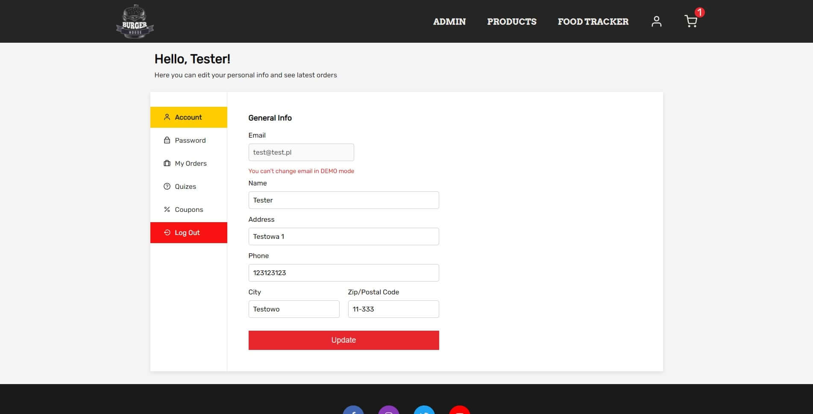
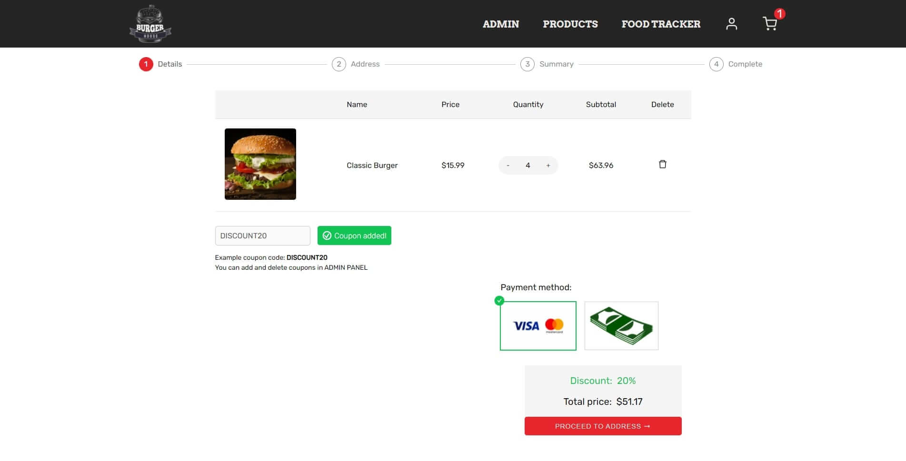
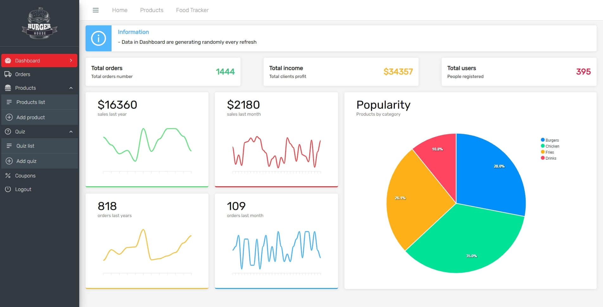

# Food Order App

> Burger House is company providing food. User can order food, track order through food tracker and participate in quizzes.

Project was created to learn React.

> Live demo [_here_](https://food-order-eryk.netlify.app/). 📍

## Table of Contents

- [Technologies Used](#technologies-used)
- [Features](#features)
- [Screenshots](#screenshots)
- [Installation](#setup)
- [Project Status](#project-status)
- [Room for Improvement](#room-for-improvement)
- [License](#license)
- [Contact](#contact)

## Technologies Used

- React
- Styled Components
- Firebase
- Context API
- React Hooks
- React Hook Form + Yup
- React Beautiful DnD
- Framer motion

## Features

- Ordering food with cart
- Admin Panel
- Food tracker for users
- Firebase Authentication
- React drag & drop
- Changing order status from admin panel in real time thanks to firestore onSnapshot() method
- Ability to make quizzes from admin panel with coupons as prizes
- Discount codes
- Ability to add, edit and delete products with uploading images to firebase storage
- Adding reviews to products with star rating
- Top products section based on product popularity

## Screenshots









## Setup

```bash
git clone https://github.com/eryk-M/food-order-app.git
npm install
npm run start
```

## Project Status

Project is: _complete_

## Room for Improvement

- add real time notifications in admin panel when order is placed (firebase functions)
- add newsletter
- connect google maps and geolocation to let user order food to actual location

## License

This website was built by eryk-M.

Copyright @ 2021 eryk-M. All Rights Reserved.

You are allowed to use it for both personal and commercial use, but not to claim it as your own project.

## Contact

Created by [@eryk-M](https://github.com/eryk-M) - feel free to contact me!
